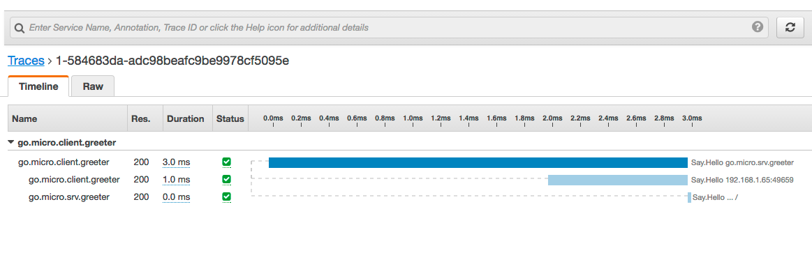

# Go AWS X-Ray [](https://opensource.org/licenses/Apache-2.0) [](https://godoc.org/github.com/micro/go-awsxray)

Go AWS X-Ray is a library to help simplify usage of AWS X-Ray for Micro

## Usage

```go
// create xray client
xray := awsxray.New(
        // Specify X-Ray Daemon Address
        awsxray.WithDaemon("localhost:2000"),
        // Or X-Ray Client
        awsxray.WithClient(xray.New(awsSession)),
)

// create segment
segment := &awsxray.Segment{
	Name: ...
	Id: ...
	TraceId: ...
	// more values
}

xray.Record(segment)
```

### With Wrappers

Wrappers scope the library for simplified use

```go
import "github.com/micro/go-plugins/wrapper/trace/awsxray"

opts := []awsxray.Option{
	// Used as segment name
	awsxray.WithName("go.micro.srv.greeter"),
	// Specify X-Ray Daemon Address
	awsxray.WithDaemon("localhost:2000"),
	// Or X-Ray Client
	awsxray.WithClient(xray.New(awsSession)),
}

service := micro.NewService(
	micro.Name("go.micro.srv.greeter"),
	micro.WrapCall(awsxray.NewCallWrapper(opts...)),
	micro.WrapClient(awsxray.NewClientWrapper(opts...)),
	micro.WrapHandler(awsxray.NewHandlerWrapper(opts...)),
)
```

### With Toolkit

Register the plugin before building Micro

```go
package main

import (
	"github.com/micro/micro/plugin"
	"github.com/aws/aws-sdk-go/service/xray"
	"github.com/micro/go-plugins/micro/trace/awsxray"
)

func init() {
	plugin.Register(awsxray.NewXRayPlugin(
		// Used as segment name
		awsxray.WithName("go.micro.http"),
		// Specify X-Ray Daemon Address
		awsxray.WithDaemon("localhost:2000"),
		// Or X-Ray Client
		awsxray.WithClient(xray.New(awsSession)),
	))
}
```

## Example

<p align="center">
  
</p>
